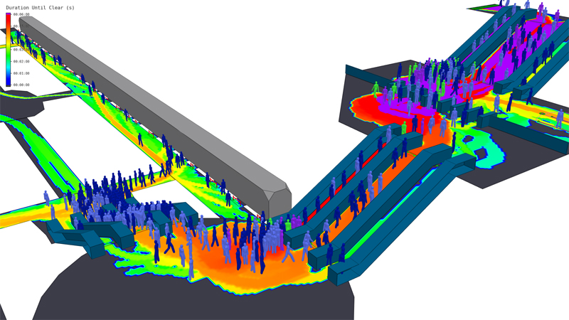
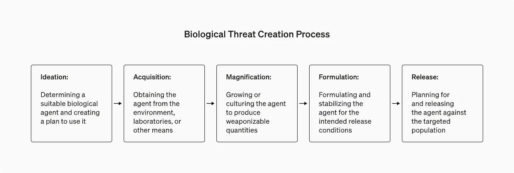
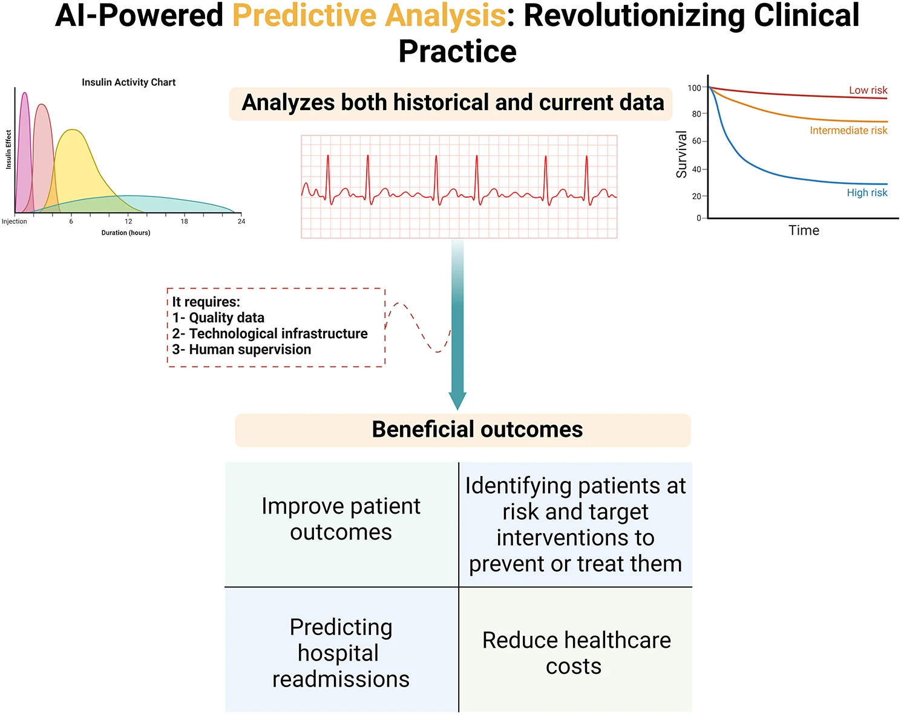
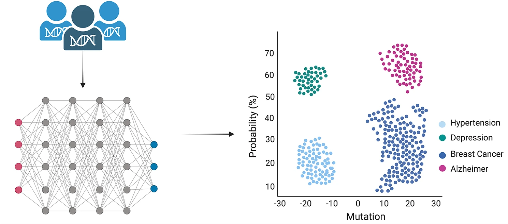
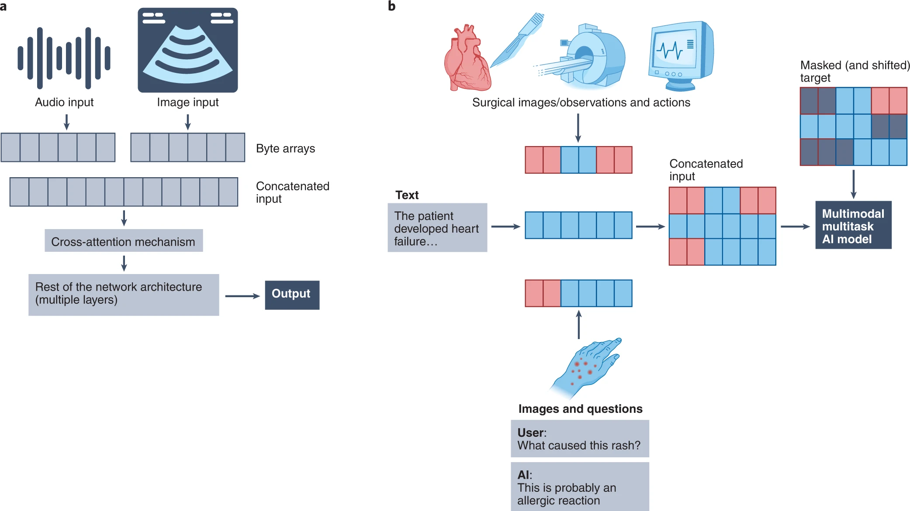
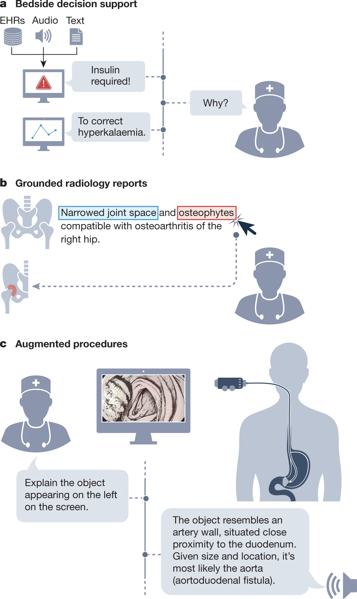
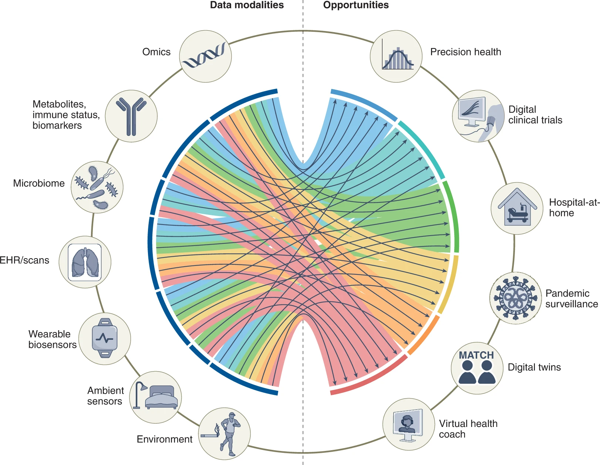

# AI Bio-Medical & Health Hazard Surveillance Solution


**University of Helsinki, FI - Building AI - Course Project**

**[Course page](https://buildingai.elementsofai.com/)**

## Summary
<p align="justify">*Chiron is an advanced bio-medical, and health hazard surveillance system powered by artificial intelligence, designed to enable early detection and rapid response to emerging public health threats. By integrating sophisticated data analytics and machine learning algorithms, *Chiron provides actionable insights to healthcare professionals and security agencies, thereby enhancing medical care, preparedness and response capabilities.</p>



## Background
<p align="justify">In an increasingly interconnected global environment, the threat posed by infectious diseases and bioterrorism necessitates proactive surveillance and intervention measures. Traditional surveillance methods often struggle to cope with the scale and complexity of modern health threats, resulting in significant delays in detection and response. *Chiron addresses these limitations by leveraging AI to analyze diverse data sources and identify potential health threats in real-time. The critical importance of this issue is underscored by the recent COVID-19 pandemic and the persistent risk of bioterrorism incidents.</p>



## How is it used? (Application)

<p align="justify">*Chiron serves as a pivotal tool for public health agencies, medical institutions, and security organizations, providing continuous monitoring and alerting capabilities. Healthcare professionals, epidemiologists, and security analysts utilize *Chiron to analyze data from various sources, including healthcare records, laboratory results, environmental sensors, and global disease surveillance networks. The system operates seamlessly across diverse environments, facilitating timely response and containment efforts in the face of emerging health threats.</p>





## Prototype System Implementation

<p align="justify">*Chiron's prototype system is built using the Python programming language and leverages the scikit-learn library for implementing an anomaly detection algorithm. Specifically, the Isolation Forest algorithm is utilized due to its effectiveness in detecting anomalies in high-dimensional datasets. The implementation involves the following steps.</p>

* **Data Preprocessing:** <p align="justify">The system reads in data from a CSV file containing health-related data, such as patient records or laboratory results. The data is then preprocessed to handle missing values, normalize features, and ensure compatibility with the Isolation Forest algorithm.</p>

* **Anomaly Detection:** <p align="justify">The Isolation Forest algorithm is applied to the preprocessed data to identify anomalous instances that deviate significantly from the norm. Anomalies are flagged as potential indicators of emerging health threats and warrant further investigation by healthcare professionals and security analysts.</p>

* **Alert Generation:** <p align="justify">Upon detecting anomalies, the system generates alerts to notify relevant stakeholders, such as public health agencies or security organizations. Alerts may include information about the detected anomalies, their severity, and recommended actions for response and containment.</p>
  
## Implementation Code

```
# Importing Required Libraries
import pandas as pd
import numpy as np
from sklearn.ensemble import IsolationForest
from sklearn.preprocessing import StandardScaler, MinMaxScaler, RobustScaler, OneHotEncoder
from sklearn.impute import SimpleImputer, KNNImputer
from sklearn.pipeline import Pipeline
from sklearn.compose import ColumnTransformer
from sklearn.decomposition import PCA
from sklearn.model_selection import train_test_split
from sklearn.metrics import classification_report, precision_score, recall_score
from datetime import datetime
import logging
import json
import os

# Configure Logging for Transparency and Debugging
logging.basicConfig(
    level=logging.INFO,
    format='%(asctime)s - %(levelname)s - %(message)s',
    filename='health_hazard_surveillance.log',
    filemode='w'
)

# Function: Load Data
def load_data(file_path):
    """
    Load dataset from a file.

    Parameters:
    - file_path: str, path to the dataset.

    Returns:
    - data: pd.DataFrame, loaded dataset.
    """
    logging.info(f"Attempting to load data from {file_path}")
    if not os.path.exists(file_path):
        logging.error(f"File not found: {file_path}")
        raise FileNotFoundError(f"File {file_path} not found.")
    
    data = pd.read_csv(file_path)
    logging.info("Data successfully loaded")
    return data

# Function: Feature Engineering
def feature_engineering(data):
    """
    Create derived features and clean invalid values.

    Parameters:
    - data: pd.DataFrame, input dataset.

    Returns:
    - enhanced_data: pd.DataFrame, dataset with new features.
    """
    logging.info("Starting feature engineering")
    
    # Example Derived Features
    if 'Height' in data.columns and 'Weight' in data.columns:
        data['BMI'] = data['Weight'] / (data['Height'] / 100) ** 2
        logging.info("BMI feature created")

    if 'Timestamp' in data.columns:
        data['Year'] = pd.to_datetime(data['Timestamp']).dt.year
        data['Month'] = pd.to_datetime(data['Timestamp']).dt.month
        data['Day'] = pd.to_datetime(data['Timestamp']).dt.day
        logging.info("Timestamp features (Year, Month, Day) created")

    # Fill invalid numerical data with NaN for further processing
    numeric_columns = data.select_dtypes(include=['float64', 'int64']).columns
    data[numeric_columns] = data[numeric_columns].apply(
        lambda x: pd.to_numeric(x, errors='coerce')
    )
    
    logging.info("Feature engineering completed")
    return data

# Function: Preprocessing Pipeline
def preprocess_data(data, categorical_cols=None, numerical_cols=None, imputation_strategy='knn', scaler_type='standard', pca_components=None):
    """
    Preprocess input data by handling missing values, scaling, and dimensionality reduction.

    Parameters:
    - data: pd.DataFrame, input data.
    - categorical_cols: list, categorical columns for encoding.
    - numerical_cols: list, numerical columns for imputation/scaling.
    - imputation_strategy: str, missing value imputation method ('mean', 'median', 'knn').
    - scaler_type: str, scaling method ('standard', 'minmax', 'robust').
    - pca_components: int, number of components for PCA.

    Returns:
    - processed_data: np.ndarray, preprocessed data ready for models.
    """
    logging.info("Starting data preprocessing pipeline")

    if not categorical_cols:
        categorical_cols = data.select_dtypes(include=['object', 'category']).columns
    if not numerical_cols:
        numerical_cols = data.select_dtypes(include=['float64', 'int64']).columns

    # Imputation
    if imputation_strategy == 'knn':
        imputer = KNNImputer(n_neighbors=5)
    else:
        imputer = SimpleImputer(strategy=imputation_strategy)

    # Scaling
    scalers = {
        'standard': StandardScaler(),
        'minmax': MinMaxScaler(),
        'robust': RobustScaler()
    }
    scaler = scalers.get(scaler_type, StandardScaler())

    # Encoding and Transformation Pipeline
    transformer = ColumnTransformer([
        ('categorical', OneHotEncoder(handle_unknown='ignore', sparse_output=False), categorical_cols),
        ('numerical', Pipeline([
            ('imputer', imputer),
            ('scaler', scaler)
        ]), numerical_cols)
    ])

    processed_data = transformer.fit_transform(data)

    # Dimensionality Reduction
    if pca_components:
        pca = PCA(n_components=pca_components)
        processed_data = pca.fit_transform(processed_data)
        logging.info(f"Applied PCA: reduced data to {pca_components} components")

    logging.info("Data preprocessing completed")
    return processed_data

# Function: Anomaly Detection
def detect_anomalies(data, contamination=0.05, random_state=42):
    """
    Detect anomalies using Isolation Forest.

    Parameters:
    - data: np.ndarray, preprocessed data.
    - contamination: float, expected anomaly rate in the data.
    - random_state: int, seed for reproducibility.

    Returns:
    - anomalies: pd.DataFrame, containing indices and scores of anomalies.
    """
    logging.info("Starting anomaly detection with Isolation Forest")
    model = IsolationForest(
        n_estimators=200,
        contamination=contamination,
        random_state=random_state
    )
    model.fit(data)

    predictions = model.predict(data)
    scores = model.decision_function(data)

    anomalies = pd.DataFrame({
        'Index': np.arange(len(predictions)),
        'Prediction': predictions,
        'Anomaly_Score': scores
    }).query('Prediction == -1')  # Filter anomalies

    logging.info(f"Anomalies detected: {len(anomalies)} instances")
    return anomalies

# Function: Export Results
def export_results(anomalies, output_file='detected_anomalies.json'):
    """
    Save anomaly detection results to a file.

    Parameters:
    - anomalies: pd.DataFrame, detected anomalies.
    - output_file: str, file path to save results.

    Returns:
    - None
    """
    logging.info(f"Saving anomalies to {output_file}")
    anomalies.to_json(output_file, orient='records', lines=True)
    logging.info("Results successfully saved")

# Main Execution Function
def main():
    """
    Main function for executing the AI Bio-Medical & Health Hazard Surveillance System.
    """
    logging.info("Starting AI Health Hazard Surveillance System")

    # Load Data
    data_path = 'health_data.csv'
    data = load_data(data_path)

    # Feature Engineering
    data = feature_engineering(data)

    # Preprocessing
    categorical_cols = ['Gender', 'Disease_Type']
    numerical_cols = ['Age', 'Height', 'Weight', 'Heart_Rate']
    processed_data = preprocess_data(
        data,
        categorical_cols=categorical_cols,
        numerical_cols=numerical_cols,
        imputation_strategy='knn',
        scaler_type='standard',
        pca_components=10
    )

    # Detect Anomalies
    anomalies = detect_anomalies(processed_data, contamination=0.02)

    # Export Anomalies
    export_results(anomalies, output_file='detected_anomalies.json')

    logging.info("System execution completed")
    print(f"Anomalies saved to 'detected_anomalies.json':\n{anomalies}")

# Run the System
if __name__ == "__main__":
    main()

## System Explanation

1. **Data Preprocessing**
* **Missing Value Handling:** <p align="justify">The data is preprocessed to handle missing values using mean imputation. This ensures that missing values are replaced with the mean value of the respective feature.</p>
  
* **Feature Normalization:** <p align="justify">Features are normalized using the StandardScaler to ensure uniform scale across different features. This step is crucial for improving the performance of the machine learning model.</p>
  
2. **Anomaly Detection**
* **Pipeline Construction:** <p align="justify">A data preprocessing pipeline is constructed using scikit-learn's Pipeline class. This pipeline encapsulates the data preprocessing steps, ensuring consistency and ease of use.</p>

* **Isolation Forest Algorithm:** <p align="justify">An Isolation Forest model is utilized for anomaly detection. Isolation Forest is a tree-based anomaly detection algorithm that isolates outliers in the dataset.</p>
  
3. **Example Usage**
* **Loading of Data:** <p align="justify">Health-related data is loaded from a CSV file ('health_data.csv'). This could include various types of health data such as patient records, laboratory results, or environmental sensor readings.</p>

* **Anomaly Detection:** <p align="justify">The *Chiron AI system is invoked to detect anomalies in the loaded dataset. Anomalies are instances that deviate significantly from the norm and may indicate potential health threats.</p>

## How it Works

* **Data Loading:** <p align="justify">The system loads health-related data from a CSV file into a pandas DataFrame.</p>

* **Data Preprocessing:** <p align="justify">The data undergoes preprocessing, including handling missing values and feature normalization, to ensure it is suitable for input into the machine learning model.</p>

* **Anomaly Detection:** <p align="justify">An Isolation Forest model is trained on the preprocessed data to detect anomalies. Anomalies are instances that are isolated from the majority of the data points, indicating potential health threats.</p>

* **Alert Generation:** <p align="justify">Detected anomalies are flagged as potential health threats, and appropriate actions, such as alerting relevant stakeholders or triggering response protocols, can be initiated based on the severity of the anomalies.</p>





## Data Sources and AI Methods
<p align="justify">*Chiron relies on a diverse array of data sources, including structured and unstructured data from healthcare systems, environmental sensors, social media, and global disease surveillance networks. Advanced AI techniques such as machine learning, anomaly detection algorithms (e.g., Isolation Forest), and natural language processing are employed to analyze and interpret these diverse data sources, facilitating the early detection of potential health threats.</p>



## Challenges
**Chiron** faces several challenges in its implementation and deployment.

* **Data Integration:** <p align="justify">Ensuring seamless integration of data from disparate sources while maintaining data quality and integrity.</p>

* **Algorithmic Accuracy:** <p align="justify">Continuous refinement and validation of AI models to improve accuracy and reduce false positives/negatives.</p>

* **Ethical Considerations:** <p align="justify">Addressing privacy concerns and ensuring ethical use of sensitive health data in compliance with regulations and standards.</p>
  
* **Scalability and Performance:** <p align="justify">Scaling the system requires robust infrastructure and optimization for real-time data processing, ensuring timely alerts as the system expands to handle larger volumes of data.</p>
  
* **Interoperability and Integration:** <p align="justify">Achieving seamless integration with existing systems necessitates adherence to industry standards and protocols, addressing compatibility challenges to ensure interoperability.</p>

* **User Adoption and Design:** <p align="justify">Providing comprehensive training, support, and a user-friendly interface is essential to facilitate effective use and widespread adoption of the system among healthcare professionals and analysts.</p>

* **Cost and Resource Management:** <p align="justify">Securing sufficient funding and efficiently managing resources are critical for the development, deployment, and maintenance of the system, ensuring sustainability and long-term success.</p>

* **Regulatory Compliance:** <p align="justify">Navigating the complex regulatory landscape governing health data and AI technology is necessary to ensure compliance with legal requirements and obtain necessary certifications and approvals for deployment.</p>
  
## What's Next? (Future Directions)
<p align="justify">*Chiron aspires to evolve into a comprehensive global bio-surveillance network, incorporating advanced features such as real-time genomic sequencing, mobile health monitoring, and predictive analytics. Continued collaboration with international partners, ongoing research and development efforts, and investment in technological infrastructure will be critical to realizing the full potential of *Chiron in safeguarding public health and national security.</p>

## Acknowledgments
<p align="justify">*Chiron draws inspiration from existing bio-medical, technology and surveillance initiatives such as ProMED, Arup, WHO, HealthMap, CDC and the Global Health Security Agenda (GHSA). The references mentioned below recognize the contributions of various data sources that have influenced the development of *Chiron. These sources have helped establish a foundation for the system's work in healthcare, bio-surveillance and health security.</p>

**Special thanks to the healthcare professionals, researchers, and technology partners working tirelessly to advance the field of bio-medicine and protect global health security.**

## References

**For the programming part:**

[1] [Python: The Python Software Foundation. (n.d.);](https://www.python.org/)
  
[2] [scikit-learn: Pedregosa et al. (2011). Scikit-learn: Machine Learning in Python. Journal of Machine Learning Research;](https://scikit-learn.org/)
  
[3] [Isolation Forest algorithm: Liu, F. T., Ting, K. M., & Zhou, Z. H. (2008). Isolation forest. In Proceedings of the 2008 Eighth IEEE International Conference on Data Mining. IEEE. doi:10.1109/ICDM.2008.17.](http://www.lamda.nju.edu.cn/publication/icdm08b.pdf)

**Everything else:**

[1] [Arup;](https://www.arup.com/services/digital/artificial-intelligence-and-machine-learning)

[2] [Oasys;](https://www.oasys-software.com/)
  
[3] [Nature;](https://www.nature.com/)

[4] [ProMED;](https://promedmail.org/)

[5] [PubMed;](https://pubmed.ncbi.nlm.nih.gov/)

[6] [HealthMap;](https://www.healthmap.org/)

[7] [Cochrane Library;](https://www.cochranelibrary.com/)

[8] [World Health Organization (WHO);](https://www.who.int/)

[9] [National Institutes of Health (NIH);](https://www.nih.gov/)

[10] [Global Health Security Agenda (GHSA);](https://www.ghsagenda.org/)

[11] [Centers for Disease Control and Prevention (CDC);](https://www.cdc.gov/)

[12] [Johns Hopkins University - Center for Health Security;](https://www.centerforhealthsecurity.org/)

[13] [European Centre for Disease Prevention and Control (ECDC).](https://www.ecdc.europa.eu/)
